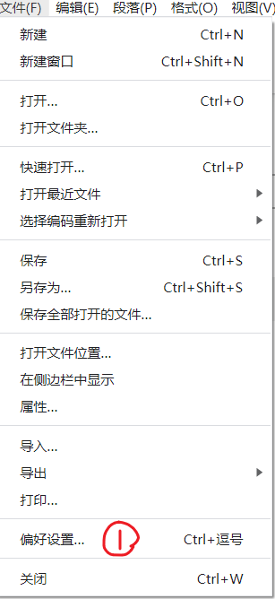
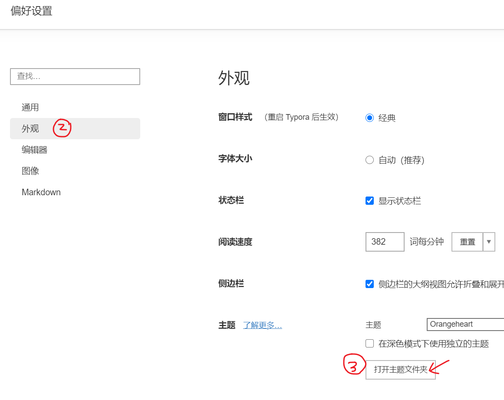
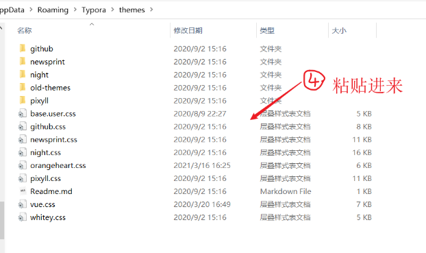
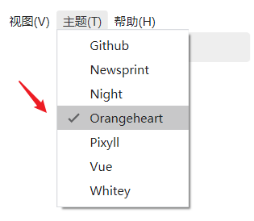

# 目标

1. 让typora能自动生成标题序号，如：1. , 1.1, 1.1.1...
2. 让typora使用自己的主题。

# 思路

把base.user.css和orangeheart.css这两个css文件（在本文件的同级目录下）放在typora的主题目录下，并重新启动Typora

# 一共5步

## 打开偏好设置

## 打开主题文件夹

## 把主题粘贴进来

## 重启typora，并切换主题

